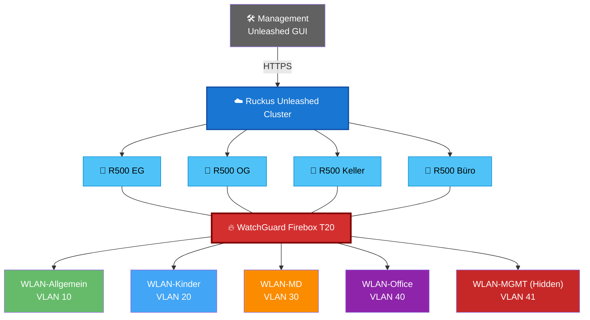

# VLAN-Konzept

## Zielsetzung

Zur Erhöhung der Sicherheit, Übersichtlichkeit und Wartbarkeit wurde das Netzwerk vollständig segmentiert.

Die einzelnen Netzbereiche werden durch VLANs logisch voneinander getrennt. Dadurch können Kommunikationsbeziehungen gezielt gesteuert, Broadcast-Domänen reduziert und unterschiedliche Sicherheitsanforderungen umgesetzt werden.

Das Routing zwischen den VLANs erfolgt ausschließlich über die WatchGuard Firebox T20. Standardmäßig besteht keine Kommunikation zwischen den einzelnen Netzwerksegmenten. Erforderliche Ausnahmen werden über explizite Firewallregeln definiert und dokumentiert.

---

## Netzwerkübersicht

| VLAN | Name | Subnetz | Zweck |
|------|------|---------|-------|
| 🟢 VLAN 10 | Allgemeines Netzwerk | 192.168.178.0/24 | Standardnetzwerk |
| 🔵 VLAN 20 | Kindernetz | 131.58.0.0/24 | Kindersicherung |
| 🟠 VLAN 30 | IoT | 10.14.0.0/24 | Smart Home |
| 🟣 VLAN 40 | Homeoffice | 192.168.179.0/24 | VPN / Arbeiten |
| 🔴 VLAN 41 | Management | 10.0.6.0/24 | Administration |

---

## Routing

Das Routing sämtlicher VLANs erfolgt über die WatchGuard Firebox.

Zwischen den VLANs existiert grundsätzlich keine direkte Kommunikation. Notwendige Kommunikationsbeziehungen werden ausschließlich über dokumentierte Firewallregeln freigegeben.

Dieses Konzept reduziert die Angriffsfläche erheblich und verhindert die unkontrollierte Ausbreitung von Schadsoftware oder Fehlkonfigurationen innerhalb des Netzwerks.

---

## DHCP

Jedes VLAN besitzt einen eigenen DHCP-Bereich.

Die DHCP-Server werden abhängig vom jeweiligen Netzsegment entweder durch die FRITZ!Box oder durch die Firebox bereitgestellt.

---

## DNS

Je nach Sicherheitsanforderung verwenden die einzelnen VLANs unterschiedliche DNS-Server.

Während das produktive Clientnetz den DNS-Dienst der FRITZ!Box nutzt, greifen IoT-, Management- und Servernetze auf die Firebox zurück.
Das Kindernetz verwendet den DNS-Dienst von pi-hole.
Das Homeofficenetz verwendet ebenfalls auf den DNS-Dienst der FRITZ!Box, arbeitet aber über den Gastnetz-Zugang.

Durch diesen Aufbau können DNS-Anfragen zentral protokolliert, gefiltert und ausgewertet oder bei Bedarf aucj geroutet oder geNATet werden.

---

## WLAN-Zuordnung

Jedes produktive WLAN ist genau einem VLAN zugeordnet.

Hierdurch können mobile Endgeräte unabhängig vom verwendeten Access Point automatisch dem korrekten Netzwerksegment zugeordnet werden.

Die VLAN-Zuweisung erfolgt über IEEE 802.1Q (VLAN Tagging).

---

## Sicherheitskonzept

Zur besseren Einordnung besitzt jedes VLAN einen definierten Vertrauensstatus.

| Symbol | Bedeutung |
|---------|-----------|
| 🟢 | Eingeschränkte Berechtigungen |
| 🟡 | Standardberechtigungen |
| 🔴 | Kritische Infrastruktur |

Diese Klassifizierung dient ausschließlich der Dokumentation und erleichtert die Bewertung neuer Firewallregeln sowie zukünftiger Erweiterungen.

---

## Architekturentscheidung

Die konsequente Segmentierung sämtlicher Netzwerkbereiche bildet die Grundlage der gesamten Sicherheitsarchitektur.

Anstatt alle Geräte innerhalb eines gemeinsamen Heimnetzwerks zu betreiben, werden Clients, Server, Smart-Home-Komponenten sowie Administrationssysteme vollständig voneinander getrennt.

Dieses Konzept orientiert sich an professionellen Unternehmensnetzwerken und verbessert sowohl die Sicherheit als auch die Wartbarkeit der gesamten Infrastruktur.

---